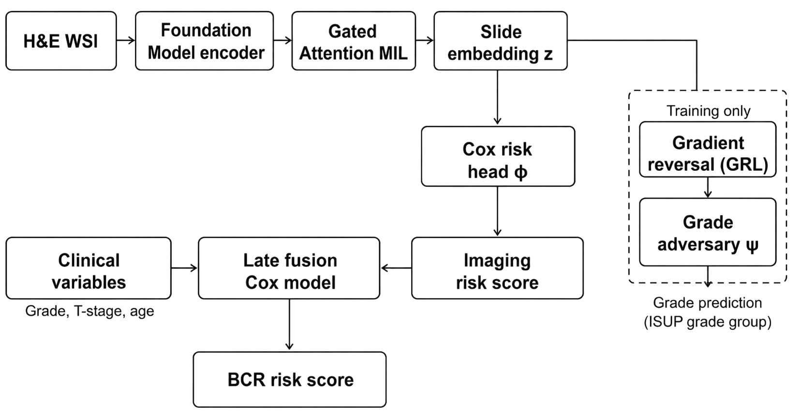

# Grade-Disentangled Multiple Instance Learning

### Multimodal Biochemical Recurrence Prediction in Prostate Cancer

[](https://www.python.org/)
[](https://pytorch.org/)
[](LICENSE)
[](https://github.com/raajuuu1998/gd-mil-bcr)



*Tiles are embedded by a **frozen** foundation model and aggregated by gated-attention MIL into a slide representation `z`. During training, a gradient-reversal grade adversary **adversarially discourages** Gleason-grade information from `z`, steering the encoder toward prognostic morphology that is **complementary** to grade. The grade-disentangled imaging risk is then late-fused with clinical variables to produce the final BCR risk score.*

---

## TL;DR

Whether routine H&E carries prognostic signal **beyond Gleason grade** for biochemical recurrence (BCR) is unsettled, and the question is easily corrupted by a subtle evaluation leak: selecting checkpoints on the same fold used for scoring. We build a **leakage-free** benchmark on TCGA-PRAD, find that the **feature extractor — not the MIL aggregator — is what matters**, and show that no imaging-only model beats a clinical baseline. We then introduce **GD-MIL**, which removes grade from the imaging representation via a gradient-reversal adversary before fusing with clinical variables. GD-MIL is the **only** method that significantly beats the clinical baseline, and it stratifies patients into clinically distinct risk groups.

|                       |                                                                                     |
| --------------------- | ----------------------------------------------------------------------------------- |
| 🧬 **Setting**         | BCR survival on TCGA-PRAD (487 patients, 101 events), strict out-of-fold evaluation |
| 📈 **Headline**        | GD-MIL **C-index 0.704** vs clinical **0.687** (Δc +0.029, paired bootstrap *p* = 0.0005) |
| 🔬 **Why it works**    | A grade adversary frees the encoder to learn signal **complementary** to grade      |
| 🧭 **Benchmark lesson** | Feature extractor quality ≫ MIL aggregator choice (≈0.06 vs 0.017 C-index spread)  |
| 🏥 **Clinical read**   | Median risk split: **~20% vs ~70%** BCR-free at 5 yr (log-rank *p* < 0.0001)        |

> **Status.** This repository accompanies a paper currently **under review**. Code and the evaluation protocol are released for reproducibility.

---

## Table of Contents

- [Method](#method)
  * [Problem setup](#problem-setup)
  * [Gated-attention MIL backbone](#gated-attention-mil-backbone)
  * [Grade-adversarial disentanglement](#grade-adversarial-disentanglement)
  * [Late multimodal fusion](#late-multimodal-fusion)
  * [Leakage-free evaluation](#leakage-free-evaluation)
- [Results](#results)
- [Installation](#installation)
- [Data](#data)
- [Reproducing the paper](#reproducing-the-paper)
- [Codebase](#codebase)
- [Notes and scope](#notes-and-scope)
- [License & citation](#license--citation)

---

## Method

### Problem setup

BCR is a right-censored survival endpoint: each patient has a follow-up time and an event indicator. A whole-slide image is tiled into `N` patches embedded by a **frozen** foundation model `φ` into `F ∈ R^{N×d}` (`d = 1536` for UNI2-h, `1280` for Virchow2, `512` for ResNet50), with up to 2000 tiles per slide. The goal is a risk score that ranks patients by recurrence hazard, scored by the censored concordance index (C-index).

### Gated-attention MIL backbone

Each tile feature is projected to `h_i ∈ R^256`. Gated attention computes a normalized per-tile weight:

```
a_i = softmax_i( wᵀ ( tanh(V h_i) ⊙ σ(U h_i) ) ),    V, U ∈ R^{128×256},  w ∈ R^{128}
```

The `tanh` gate scores relevance and the `σ` gate scores inclusion; together they suppress uninformative tiles more effectively than a single gate. The slide representation is the layer-normalized attention-weighted sum `z = LayerNorm(Σ_i a_i h_i) ∈ R^256`.

### Grade-adversarial disentanglement

Much of what an imaging model learns is a proxy for Gleason grade — the variable clinicians already record — leaving little independent signal. GD-MIL attaches a grade adversary through a **Gradient Reversal Layer** (GRL):

```
ĝ = ψ( R_λ(z) ),        ∂R_λ/∂z = −λ I
L = L_cox(r_img) + λ · ‖ ĝ − g ‖²₂ ,     λ = 0.5
```

On the forward pass `R_λ` is the identity; on the backward pass it negates and scales the gradient. The encoder is thus pushed to keep `z` predictive of BCR while making `z` uninformative about grade — **adversarially discouraging** grade information rather than formally removing it. At inference the adversary is discarded.

### Late multimodal fusion

The grade-disentangled imaging risk `r_img` is concatenated with clinical variables (grade group, T-stage, age) and an L2-penalized Cox model produces the final GD-MIL risk score. Crucially, the fusion Cox is fitted **only on out-of-fold imaging risks**, so the leakage-free guarantee extends through the full pipeline.

### Leakage-free evaluation

A widespread pitfall selects checkpoints on the same fold used for scoring, inflating concordance. We avoid it: 5-fold stratified CV, with a 15% inner split per fold reserved **only** for early stopping and the outer test fold never used for selection. Each patient gets a single out-of-fold (OOF) risk; the C-index is computed once over all 487 OOF predictions, repeated across 5 seeds. Pairwise significance uses a paired bootstrap with 2000 resamples. Full derivation in [`docs/method.md`](docs/method.md).

```python
from gdmil import get_model, run_cv_oof, fit_fusion_oof
import pandas as pd, torch, glob, os

cohort = pd.read_csv("data/TCGA_PRAD/cohort.csv")
cache  = {("-".join(os.path.basename(f)[:-3].split("-")[:3])):
          torch.load(f, weights_only=False)["features"].float()
          for f in glob.glob("data/TCGA_PRAD/embeddings_uni2h/*.pt")}

# GD-MIL backbone: grade-adversarial OOF imaging risk
img_oof = run_cv_oof(lambda: get_model("gadvmil", 1536, lam=0.5),
                     lambda pid: cache[pid], cohort, 1536, "cuda",
                     use_grade_adv=True)

# late fusion with clinical variables -> final GD-MIL risk
final = fit_fusion_oof(cohort, img_oof)
```

---

## Results

All models use a **frozen** backbone with precomputed features; only the lightweight MIL head and the fusion Cox are trained. Every number is strictly out-of-fold, aggregated across 5 seeds. C-index is the primary metric.

### Benchmark — TCGA-PRAD (487 patients, 101 BCR events)

The MIL aggregator barely moves the needle; the feature extractor and multimodal fusion are what matter. **GD-MIL is the only method whose entire 95% CI lies above the clinical baseline.**

| Category   | Method               | C-index           | 95% CI           |
| ---------- | -------------------- | ----------------- | ---------------- |
| Clinical   | Cox (grade, T, age)  | 0.687 ± 0.005     | [0.612, 0.726]   |
| Imaging    | ResNet50 + ABMIL     | 0.566 ± 0.024     | [0.520, 0.645]   |
| Imaging    | UNI2-h + CLAM        | 0.627 ± 0.022     | [0.559, 0.690]   |
| Imaging    | UNI2-h + ABMIL       | 0.624 ± 0.026     | [0.549, 0.677]   |
| Imaging    | UNI2-h + TransMIL    | 0.632 ± 0.022     | [0.552, 0.682]   |
| Imaging    | UNI2-h + PatchGCN    | 0.615 ± 0.036     | [0.556, 0.684]   |
| Imaging    | Virchow2 + ABMIL     | 0.639 ± 0.007     | [0.573, 0.704]   |
| **Multimodal** | **GD-MIL (ours)** | **0.704 ± 0.003** | **[0.643, 0.752]** |

### Paired bootstrap significance (2000 resamples)

| Method        | Comparator       | Δc      | 95% CI            | *p*       |
| ------------- | ---------------- | ------- | ----------------- | --------- |
| GD-MIL (ours) | Clinical Cox     | +0.029  | [+0.015, +0.046]  | **0.0005** |
| GD-MIL (ours) | ABMIL / UNI2-h   | +0.085  | [+0.026, +0.144]  | **0.003**  |
| GD-MIL (ours) | ABMIL / Virchow2 | +0.062  | [+0.004, +0.118]  | **0.039**  |
| ABMIL / Virchow2 | Clinical Cox  | −0.033  | [−0.097, +0.031]  | 0.310     |
| ABMIL / UNI2-h | Clinical Cox    | −0.056  | [−0.124, +0.011]  | 0.112     |

### Figures


***Figure 1. C-index across all methods** (TCGA-PRAD). Error bars are 95% bootstrap CIs (2000 resamples); the dashed line marks the clinical Cox baseline (0.687). GD-MIL (orange) is the only method whose full CI clears the clinical baseline. All imaging-only methods fall below it — consistent with the non-significant p-values above.*


***Figure 2. Risk stratification by median GD-MIL score.** High-risk (n=244, 76 events) vs low-risk (n=243, 25 events) separate immediately and stay separated for five years with no crossover (log-rank *p* < 0.0001). The three-fold difference in event rate (31.1% vs 10.3%) is consistent with a genuine difference in recurrence burden.*


***Figure 3. Attention maps, tighter colormap scale** (TCGA-2A-A8W3, ISUP 5, BCR=1). ABMIL (left) attends to a visually prominent region in the left-centre; GD-MIL (right) redirects to a distinct morphological region in the right-centre, qualitatively consistent with grade-disentangled attention. Single-case interpretation is necessarily illustrative.*


***Figure 4. Same case, broader colormap scale.** ABMIL produces near-zero attention across the slide; GD-MIL retains a sharp focal activation in the right-centre region, indicating more spatially concentrated attention weights. Cool = low, warm/orange = high.*

---

## Installation

```bash
git clone https://github.com/raajuuu1998/gd-mil-bcr.git
cd gd-mil-bcr
pip install -r requirements.txt
pip install -e .          # exposes the `gdmil` package
```

Python ≥ 3.9, PyTorch ≥ 2.0. A single GPU is sufficient — the backbone is frozen and features are precomputed, so every experiment runs on modest hardware.

---

## Data

This repository operates on **precomputed tile embeddings**; raw WSIs and the foundation-model forward pass are upstream and not included. Slides are from TCGA-PRAD; BCR labels and clinical variables are derived from the TCGA clinical files.

Arrange the data as:

```
data/
└── TCGA_PRAD/
    ├── cohort.csv                       # patient_id, bcr_event, survival_time, grade_group, t_stage, age
    └── embeddings_uni2h/{pid}.pt        # dict: features[N,1536], coords[N,2]
        embeddings_virchow2/{pid}.pt     # dict: features[N,1280], coords[N,2]
        embeddings_resnet50/{pid}.pt     # dict: features[N, 512], coords[N,2]
```

Each `.pt` is a dict with keys `features` and `coords` (and any extra metadata).

**Feature-extraction details.** Tiles of 256 × 256 px were extracted at ≈ 1.0 µm/px (~10× magnification) from tissue found by an HSV filter, capped at 2000 tiles per slide, with coordinates saved alongside features. Three backbones were applied independently: [UNI2-h](https://huggingface.co/MahmoodLab/UNI2-h) (1536-d), Virchow2 (1280-d), and ImageNet ResNet50 (512-d). No stain normalization or augmentation was used.

---

## Reproducing the paper

```bash
# 1. Clinical Cox baseline
python scripts/train.py --clinical-only --out results/clinical.json

# 2. Imaging baselines (example: ABMIL on each backbone)
python scripts/train.py --model abmil    --fm resnet50 --out results/abmil_resnet50.json
python scripts/train.py --model abmil    --fm uni2h    --out results/abmil_uni2h.json
python scripts/train.py --model clam     --fm uni2h    --out results/clam_uni2h.json
python scripts/train.py --model transmil --fm uni2h    --out results/transmil_uni2h.json
python scripts/train.py --model patchgcn --fm uni2h    --out results/patchgcn_uni2h.json
python scripts/train.py --model abmil    --fm virchow2 --out results/abmil_virchow2.json

# 3. GD-MIL: grade-adversarial backbone + late fusion with clinical variables
python scripts/train.py --model gadvmil --fm uni2h --grade-adv --fuse \
    --out results/fusion_gdmil.json

# 4. Benchmark table (Table 1) + paired significance (Table 2)
python scripts/eval.py --results_dir results --cohort data/TCGA_PRAD/cohort.csv

# 5. Regenerate Figures 1-2 (C-index bar + Kaplan-Meier)
python scripts/make_figures.py --results_dir results \
    --cohort data/TCGA_PRAD/cohort.csv --assets_dir assets
```

| Hyperparameter | Value          |   | Hyperparameter   | Value     |
| -------------- | -------------- | - | ---------------- | --------- |
| Folds          | 5 (stratified) |   | Optimizer        | Adam      |
| Inner val      | 15% (early stop) |  | Learning rate    | 3 × 10⁻⁴  |
| Epochs         | 30             |   | Weight decay     | 1 × 10⁻⁵  |
| Hidden dim     | 256            |   | Grad clip        | 1.0       |
| Adversary λ    | 0.5            |   | Cox penalizer    | 0.1       |
| Bootstrap      | 2000 resamples |   | Seeds            | 5         |

Full configuration in [`configs/default.yaml`](configs/default.yaml).

---

## Codebase

| Module                                            | Contents                                                                                  |
| ------------------------------------------------- | ----------------------------------------------------------------------------------------- |
| [`gdmil/models.py`](gdmil/models.py)              | **The method** — `GAdvMIL` (GD-MIL backbone), `GradReverse`/`grad_rev`, plus `ABMIL`, `CLAM`, `TransMIL`, `PatchGCN`, `get_model` |
| [`gdmil/engine.py`](gdmil/engine.py)              | `train_one_epoch` (with optional grade adversary), `evaluate`, `run_cv_oof` (leakage-free OOF) |
| [`gdmil/fusion.py`](gdmil/fusion.py)              | `fit_fusion_oof` (late multimodal Cox), `fit_clinical_oof` (clinical baseline)            |
| [`gdmil/losses.py`](gdmil/losses.py)              | `cox_loss` (Breslow partial likelihood, stable `logcumsumexp`)                            |
| [`gdmil/stats.py`](gdmil/stats.py)                | `bootstrap_ci`, `paired_bootstrap_test`, `cindex`                                          |
| [`gdmil/data.py`](gdmil/data.py)                  | `BCRDataset`, `collate_fn`, `get_emb_path`                                                 |
| [`scripts/train.py`](scripts/train.py)            | Train any model under 5-fold CV; optional `--grade-adv` and `--fuse`                       |
| [`scripts/eval.py`](scripts/eval.py)              | Benchmark table + paired bootstrap significance                                           |
| [`scripts/make_figures.py`](scripts/make_figures.py) | Regenerate the C-index bar chart and Kaplan-Meier curve                                 |

```
gd-mil-bcr/
├── gdmil/                    # installable package
│   ├── models.py            # GD-MIL backbone + MIL aggregators (the method)
│   ├── engine.py            # train / evaluate / leakage-free OOF CV
│   ├── fusion.py            # late multimodal Cox fusion
│   ├── losses.py            # Cox partial likelihood
│   ├── stats.py             # bootstrap CI + paired bootstrap test
│   └── data.py              # dataset / collate
├── scripts/                 # train / eval / figures entry points
├── configs/default.yaml     # all hyperparameters + data layout
├── docs/method.md           # detailed method description
├── assets/                  # figures
├── requirements.txt
├── setup.py
└── LICENSE
```

---

## Notes and scope

- **Scope.** This release covers the single-cohort TCGA-PRAD setting reported in the paper. Cross-cohort external validation is future work.
- **Leakage-free by construction.** Checkpoint selection uses an inner validation split only; the test fold is never seen during selection, and the fusion Cox is fitted on OOF imaging risks. This is the central methodological contribution.
- **Attention maps are qualitative.** Figures 3-4 are hypothesis-generating; rigorous interpretation would require pathologist-annotated regions of interest.
- **Not included.** Raw WSIs and the foundation-model forward pass are not redistributed; obtain TCGA slides from their original sources and extract embeddings upstream.

---

## License & citation

Released under the [MIT License](LICENSE).

```bibtex
@misc{gdmil2026,
  title  = {GD-MIL: Grade-Disentangled Multiple Instance Learning for
            Multimodal Biochemical Recurrence Prediction in Prostate Cancer},
  author = {Dasari Naga Raju},
  year   = {2026},
  note   = {Under review}
}
```
